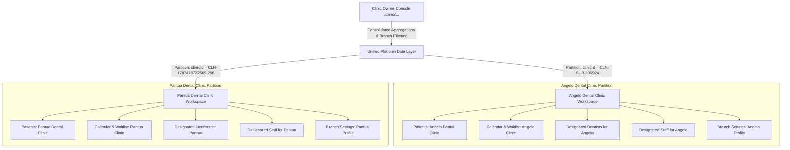
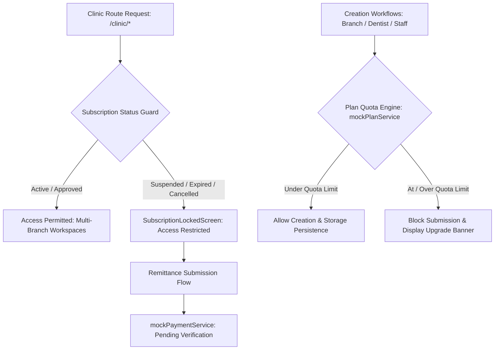
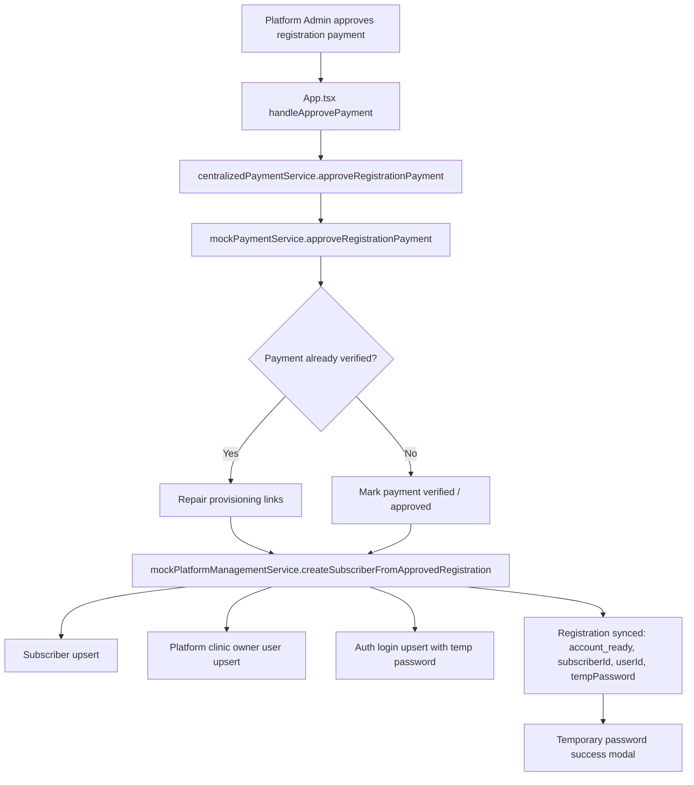
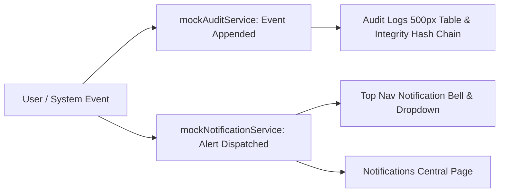
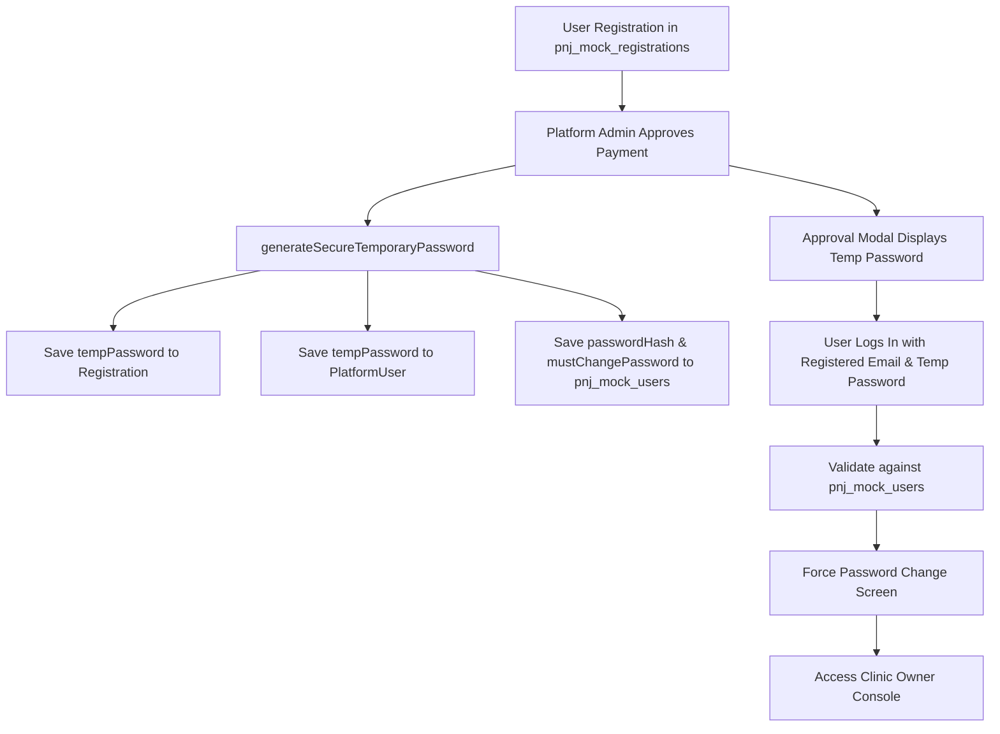

# Architecture

## Supabase Phase 1 Foundation - August 26, 2026

- The production target is relational: `subscriber_id` is the tenant boundary and `clinic_id` is the branch boundary for operational and clinical rows.
- Supabase Auth will own identities; application membership and assignment tables will own role authorization. RLS, not frontend route guards, will enforce production access.
- See `context/supabase_phase_1_foundation.md` for the proposed table map, approval transaction boundary, storage plan, and policy matrix.

## Full-System Diagnostic Boundary - August 26, 2026

- Current architecture has no Supabase client, SQL migrations, API/server layer, RLS policies, Docker deployment definition, or Vercel configuration.
- Existing tenant and role isolation is enforced in client services and route guards only; production authorization must move to server-side policies.
- Build succeeds, but the single bundled route shell is large and should be split before production rollout.

## Layers

- Clinic Owner layer: `/clinic/*`
- Clinic Subsystem layer: `/clinic/:clinicId/*`
- Platform Owner layer: `/platform/*`

## Batch 1 Auth & Seed Cleanup Checkpoint - August 25, 2026

- Login is now read-only for provisioning: `mockAuthService.login` validates against `pnj_mock_users` and no longer creates a missing auth user from registration or platform-user fallback data.
- Approval/provisioning remains the intended creator of clinic-owner auth rows, temporary passwords, subscribers, subscriptions, and primary clinics.
- Deleted subscriber emails remain blocked during login. Fresh signup/provisioning can explicitly create new state, but sign-in itself does not revive deleted accounts.
- Platform Users no longer assign orphan Associate Dentist or Staff records to a default subscriber or `CLN-SUB-396924`. Personnel rows without a valid `subscriberId` are ignored until properly scoped.
- Laboratory initialization no longer auto-creates partner labs from registration `worksWithLab` fields. Lab records must be created by an explicit owner/platform workflow after approval.

## Batch 2 Approval-Only Provisioning Checkpoint - August 25, 2026

- Pending signup/payment submissions remain registration/payment records only. `mockSubscriptionService.listSubscriptions()` derives temporary pending subscription display rows from registrations without persisting subscribers, clinics, auth users, or real subscriptions.
- Payment approval is the provisioning boundary. `mockPaymentService.approveRegistrationPayment()` is responsible for generating/syncing the temporary password and creating the subscriber, owner platform user, auth login, primary clinic, and active subscription.
- `mockPlatformManagementService.listSubscribers()` is read-only and no longer creates subscribers from approved registrations.
- `tenantScope.ts` is read-only during clinic owner route resolution and reports missing provisioning instead of silently creating tenant records.

## Batch 3 Temp Password, Branch Guard, and Route Verification Checkpoint - August 26, 2026

- `mockAuthService.login` now resolves session `clinicName` from the linked clinic/subscriber record instead of copying the raw branch `clinicId` into session state.
- Email-only account status checks return `ready` only when an auth credential exists. Approved records with missing provisioning are shown as setup-incomplete pending records so the platform operator can re-run payment approval.
- Approval repair issues a fresh temporary password only for users still in `mustChangePassword` state. Users who already changed their password keep their real password.
- `completePasswordChangeByEmail` clears registration `tempPassword` after first-login password setup, while preserving `account_ready` status.
- `/clinic/:clinicId/*` branch routes are authorized against the logged-in subscriber. Branch IDs from another subscriber now resolve to a restricted/not-found workspace instead of opening cross-tenant data.
- Master File Directory owner scope remains `/clinic/directory/*`; branch scope remains `/clinic/:clinicId/master-files/*`.

## Batch 4 Fresh-Test Reset and Backup Coverage Checkpoint - August 26, 2026

- Approval repair is fully idempotent for changed-password clinic owners: platform user `mustChangePassword` remains false, registration `tempPassword` remains blank, and real passwords are preserved.
- Backup/restore now has a `branch_workspace` module so branch clinical records are visible to backup manifests, restore previews, storage footprint summaries, and pre-reset checkpoints.
- Dynamic branch/patient localStorage keys are included through prefixes for branch settings, patient directory drafts, progress notes, bills, appointments, dental recalls, dental chart history, certificates, uploads, scratchpad notes, follow-up lists, and treatment records.
- Emergency reset continues to clear non-session prototype data for a fresh test environment, then reinitializes only platform-support baselines; the app-level reset flow signs the user out and returns to login.

## Batch 5 Registration Visibility and Owner Routing Checkpoint - August 26, 2026

- `mockPlatformManagementService.listSubscribers()` now includes derived pending subscriber projections from `pnj_mock_registrations` for records that are still `unpaid` or `pending_verification`. This keeps the Clinic Owners workflow visibly pending before approval instead of relying only on persisted subscriber records.
- `mockPaymentService.listPayments()` now includes derived registration payment projections for registrations that are still `unpaid` or `pending_verification` and do not yet have a persisted payment row. This keeps Payments & Receipts aligned with the same onboarding pending state.
- `mockPaymentService.approveRegistrationPayment()` now skips projected `PAY-PENDING-*` display rows and creates a real payment ledger record before approval when no persisted payment exists.
- `mockClinicService.listClinics()` now includes derived pending clinic projections from registration records, so the Dental Clinics registry can show the registered clinic as `pending` before approval and then swap to the real persisted clinic after approval.
- `mockPlatformManagementService.purgeRequestedPendingRegistration()` now uses a new cleanup marker version and broader cascade matching by registration ID plus normalized email-linked payment rows. This lets existing browsers re-run the cleanup for the retired `sad@gmail.com` ghost record and also removes that retired email from the deleted blacklist so future fresh registrations are not accidentally blocked.
- `App.tsx` signup checkout now calls only `centralizedPaymentService.submitRegistrationPayment`. The old parallel legacy `mockPaymentService.submitPayment` path was removed so onboarding no longer writes malformed duplicate payment rows into the shared local payment ledger.
- `mockPlatformManagementService.ensureSeedData()` now runs a second cleanup sweep based on the deleted blacklist to remove orphaned artifacts across registrations, payments, subscribers, platform users, auth users, clinics, subscriptions, dentists, and staff.
- `PaymentsPage.tsx` KPI cards now show real summary values only, so an empty payments ledger no longer looks like it still has verified cash collections.
- `ClinicBranchesPage.tsx` now recognizes `pending` clinic status in the clinic owner branch directory instead of folding it into an archived-looking display state.
- The clinic owner shared Master File Directory was removed from sidebar navigation. Owner visits to `/clinic/directory/*` now stop at an explanatory return screen, while branch-only master files continue under `/clinic/:clinicId/master-files/*`.

## Batch 6 Stale-Safe Purge Control Checkpoint - August 26, 2026

- `mockBackupRestoreService.staleSafePurge()` now provides a targeted prototype cleanup path that clears processed platform ledgers and linked branch workspace traces without wiping platform admin auth, settings baselines, or restore checkpoints.
- The purge targets subscribers, platform users, registrations, subscriptions, payments, clinics, laboratories, staff, associate dentists, deleted-blacklist artifacts, OTP leftovers, notifications, activity logs, audit logs, and dynamic branch clinical storage keys.
- `App.tsx` now exposes this cleanup through a platform-owner-only navbar control beside `Prototype Mode`, guarded by a typed confirmation phrase: `PURGE STALE DATA`.
- This creates a pre-purge checkpoint first, then dispatches `DATA_RESTORE_COMPLETED` so platform and branch screens can refresh against the cleaned state.

## Multi-Branch Subsystem Architecture & Storage Partitioning



- **Branch-Scoped Storage Partitioning**:
  - The selected `clinicId` remains in the route URL (`/clinic/:clinicId/...`) for every branch operation.
  - Patient Directory (`patientDirectoryStore.ts`) tags every patient with `clinicId` and `clinicName`. `loadPatientDirectoryRecords(clinicId)` ensures queries in a branch workspace only return patients registered in that branch.
  - `savePatientDirectoryRecords(records, clinicId)` merges branch records into the global database so saving in one clinic never wipes or impacts other clinics.
  - Calendar and Appointments (`scheduleStorage.ts`) tag items with `clinicId` and scope `getClinicScheduleItems` and `saveClinicScheduleItems` by `clinicId`.
  - Branch Settings (`branchSettingsStore.ts`) are stored under `pnj_mock_branch_settings_<clinicId>` and dynamically populate new branches from `mockClinicService`.

## Personnel Designation (Associate Dentists & Staff)

- Associate Dentists (`mockAssociateDentistService.ts`) and Staff (`mockStaffService.ts`) track designated branches via `clinicIds` and `authorizedClinics`.
- `listDentistsForClinic(clinicId)` and `listStaffForClinic(clinicId)` filter personnel assigned to that active branch.
- Within the branch workspace:
  - Appointment dentist pickers only show authorized dentists.
  - Daily Reports & Daily Results (`DentistStaffDailyLedger.tsx`) only list dentists and staff on duty for that branch.
- Within the Clinic Owner Console (`/clinic/dentists`, `/clinic/staff`), the owner can assign dentists/staff to specific branches or multi-branch coverage.

## Subscription Gatekeeper & Real Quota Enforcement Architecture



- **Navigation Guard**: In `App.tsx`, active subscriptions are evaluated against the current route. If an account is suspended or expired, the `SubscriptionLockedScreen` replaces the operational workspace with an interactive GCash renewal modal.
- **Quota Engine**: `ClinicBranchCreatePage.tsx`, `ClinicLaboratoryFormPage.tsx`, `AssociateDentistFormPage.tsx`, and `StaffFormPage.tsx` calculate real-time resource allocations against the subscriber's active plan limits (`Basic`: 1 branch / 1 dentist / 0 labs / 3 staff; `Plus`: 3 branches / 6 dentists / 2 labs / 20 staff; `Max`: Unlimited), proactively rendering capacity warning alerts and disabling creation submissions.

## Registration Approval Provisioning Architecture



- **Single Approval Owner**: `App.tsx` no longer calls both centralized and legacy local payment approval. The centralized payment service is the only approval entry point from the Platform UI.
- **Idempotent Repair**: Re-approving an already verified payment triggers a provisioning repair pass instead of failing. This protects against cases where a payment was approved but the subscriber, owner user, auth login, or registration links were stale/missing.
- **Owner Login Upsert**: `mockPlatformManagementService.createOwnerUserForSubscriber` updates existing platform/auth users by owner email or creates them when absent. Users still flagged `mustChangePassword` receive a fresh random temporary password on approval/repair; users who already changed passwords keep their existing credential.
- **Registration Back-Sync**: Approved registration records are always updated with `paymentStatus: approved`, `registrationStatus: account_ready`, `subscriberId`, `userId`, `tempPassword`, and `updatedDate`.
- **Email-Only Status Lookup**: `/login` now supports email-only approval checking. `App.tsx` resolves the email against registrations, subscribers, and platform owner users, then returns a custom `ready`, `pending`, `rejected`, or `not_found` UI card. Ready accounts can copy the synced temporary password without requiring a browser alert or password entry.
- **First-Login Password Change**: Approved clinic-owner accounts with `mustChangePassword` are routed to `/clinic/change-password` after temp-password login. `App.tsx` validates the temporary password and new password rules, then `mockPlatformManagementService.completePasswordChangeByEmail(email)` clears first-login flags, syncs auth status, updates `lastLoginAt`, and routes to the Clinic Owner dashboard.
- **Branch Route Authorization**: `App.tsx` verifies that the branch loaded from `/clinic/:clinicId/*` belongs to the logged-in subscriber before rendering the subsystem workspace.
- **Phase 5 Tenant Isolation**: Clinic Owner console datasets now resolve the logged-in owner email to a subscriber context, then scope branches, staff, dentists, laboratories, patient aggregates, financial summaries, analytics, daily reports, and activity feeds to that subscriber. Master File Directory owner/branch route separation remains a later phase.
- **Phase 6 Branch/Sub-System Patient Clinical Isolation**: Patient clinical records inside `/clinic/:clinicId/*` now persist under patient + clinic scoped keys so branch workspaces no longer share progress notes, bills, appointments, recalls, dental chart records, certificates, or contract/patient form state.
- **Phase 7 Master File Directory Route Isolation**: Owner master files use `/clinic/directory/*`; branch master files use `/clinic/:clinicId/master-files/*`. Both scopes reuse the Master File Directory UI, but route base, back navigation, navbar behavior, and clinic context are explicitly separated to prevent owner console navigation from jumping into a branch subsystem.
- **Phase 8 Verification + Context Sync**: Confirmed the Phase 7 owner/branch route split remains documented across context files and verified the project build with 0 errors.

## Subscriber / Tenant Data Isolation Architecture

```mermaid
flowchart TD
    LoginEmail[Logged-in clinic owner email] --> SubscriberLookup[mockPlatformManagementService: subscriber/user lookup]
    SubscriberLookup --> TenantScope[tenantScope.ts subscriberId resolver]
    TenantScope --> OwnerConsole[Clinic Owner Console]
    OwnerConsole --> Branches[mockClinicService.getClinicsBySubscriberId]
    OwnerConsole --> Dentists[mockAssociateDentistService.getDentistsBySubscriberId]
    OwnerConsole --> Staff[mockStaffService.getStaffBySubscriberId]
    OwnerConsole --> Labs[mockLaboratoryService.getLaboratoriesBySubscriberId]
    Branches --> Patients[patientDirectoryStore records scoped by clinicId]
    Patients --> Financials[aggregateClinicFinancials(scopedPatients)]
    Financials --> Reports[Dashboard / Sales / Analytics / Daily Reports / Activity Feed]
```

- **Tenant Scope Utility**: `src/features/clinic-owner/services/tenantScope.ts` normalizes subscriber IDs and supports the legacy primary aliases (`SUB-000001`, `SUB-396924`, `sub_001`) so older Angelo records remain readable without leaking into unrelated subscribers.
- **Owner Console Scoping**: `ClinicOwnerDashboardPage.tsx`, `GeneralSettingsPage.tsx`, `StaffManagementPage.tsx`, `AssociateDentistsPage.tsx`, `StaffFormPage.tsx`, and `AssociateDentistFormPage.tsx` now use subscriber-scoped branch, staff, dentist, and laboratory datasets.
- **Scoped Aggregation**: Clinic Owner dashboard widgets, Sales Overview, Analytics resource snapshots, Daily Reports, and Activity Feed pass subscriber branch patients into `aggregateClinicFinancials(scopedPatients)` instead of using global ledgers.
- **Activity Feed Branch Labels**: `ActivityFeed.tsx` receives subscriber and branch context, resolves branch names through `mockClinicService.getClinicsBySubscriberId(subscriberId)`, and uses scoped branch labels in timeline messages instead of fixed clinic names.
- **Personnel Assignment Safety**: Staff and Associate Dentist steppers only show clinics and laboratories owned by the current subscriber. Daily Reports branch matching accepts branch IDs, branch names, and branch codes for backwards compatibility with older saved personnel records.

## Branch / Sub-System Patient Clinical Isolation Architecture

```mermaid
flowchart TD
    BranchRoute[/clinic/:clinicId/*] --> PatientRecord[Patient record with clinicId]
    PatientRecord --> ClinicalScope[patientClinicalStorage.ts]
    ClinicalScope --> Notes[clinicProgressNotes:clinicId:patientId]
    ClinicalScope --> Bills[clinicBillPayments:clinicId:patientId]
    ClinicalScope --> Appts[clinicAppointments:clinicId:patientId]
    ClinicalScope --> Recalls[clinicDentalRecalls:clinicId:patientId]
    ClinicalScope --> Chart[clinicDentalChart(s):clinicId:patientId]
    ClinicalScope --> Docs[clinicCertificates / patientContractForm:clinicId:patientId]
    Notes --> SyncChain[Progress Note Sync Chain]
    SyncChain --> Bills
    SyncChain --> Appts
    SyncChain --> Recalls
    SyncChain --> Calendar[scheduleStorage clinic schedule partition]
```

- **Scoped Key Contract**: `src/features/clinic-subsystem/patients/clinical/shared/patientClinicalStorage.ts` centralizes `${prefix}${clinicId}:${patientId}` keys and legacy `${prefix}${patientId}` fallback reads.
- **Active Write Target**: New and edited clinical records write to the active patient's `clinicId`; legacy keys are read only as a migration fallback.
- **Synchronized Clinical Chain**: Saving a progress note can create or update linked bills, patient appointment recalls, dental recalls, and calendar recall items inside the same clinic partition only.
- **Safe Cleanup**: Deleting a patient, deleting a progress note, or removing linked recalls purges only the matching patient + clinic records and does not touch records in sibling branches.
- **Balance Safety**: Billing balance updates match both `patientId` and `clinicId` before mutating a patient directory record.

## Master File Directory Routing Architecture

```mermaid
flowchart TD
    OwnerConsole[Clinic Owner Console] --> OwnerDirectory[/clinic/directory/*]
    OwnerDirectory --> OwnerContext[OWNER-MASTER-FILES context]
    OwnerDirectory --> OwnerBack[/clinic/dashboard]
    BranchConsole[Branch Subsystem] --> BranchDirectory[/clinic/:clinicId/master-files/*]
    BranchDirectory --> BranchContext[active currentClinic context]
    BranchDirectory --> BranchBack[/clinic/:clinicId/dashboard]
    OwnerDirectory --> SharedRenderer[renderMasterFileDirectoryContent(routeBase, context)]
    BranchDirectory --> SharedRenderer
```

- **Owner Scope**: `App.tsx` treats `/clinic/directory` and nested `/clinic/directory/*` as Clinic Owner routes, not branch routes.
- **Current Owner UX**: Owner scope no longer opens editable master-file content. The route now exists only as a safe redirect/notice so branch isolation is preserved.
- **Branch Scope**: `/clinic/:clinicId/master-files/*` remains a branch route and uses the active clinic ID for section URLs and PDF Designer context.
- **Reusable Route Base**: `MasterFileDirectoryLayout`, `MasterFileDirectorySidebar`, `MasterFileNavGroup`, and `MasterFileDirectoryDashboardPage` accept `routeBase` and back-navigation props so the same UI can render safely in either scope.
- **Navigation Guard**: In owner scope, navbar Add Patient redirects to clinic branches with a toast because patient creation is branch-only.


## Central Financial & Clinical Aggregation Architecture

- **Single Source of Truth**: `aggregateClinicFinancials(inputPatientsOrDate, targetDate)` in `billPaymentStore.ts` serves as the central data bridge across the entire platform.
- **Dynamic Scoping**:
  - When passed a branch-filtered patient array `aggregateClinicFinancials(patients)`, it computes revenue, collections, outstanding balances, and dentist productivity strictly for that branch.
  - When called without arguments, it aggregates company-wide figures across all branches for Clinic Owner executive dashboards and sales reports.
- **Aggregation Pipeline**:
  1. Gathers registered patients from `patientDirectoryStore.ts` (filtered or global).
  2. Traverses all patient + clinic scoped billing records (`clinicBillPayments:${clinicId}:${patientId}`) and clinical progress notes (`clinicProgressNotes:${clinicId}:${patientId}`), with legacy patient-only keys read only as a migration fallback.
  3. Computes:
     - `grossBilled`: Total value of all clinical service lines and procedure invoices.
     - `totalCollected`: Total cash, digital, and card payments received.
     - `totalOutstanding`: Real-time receivables balance (`payableAmount - paidAmount`).
     - `paymentMethodTotals`: Exact distribution across Cash, GCash/Maya, Credit Card, and HMO.
     - `todayCollections`: Segregated cash and digital collections for End-of-Day (EOD) audit.
     - `dentistProduction`: Tally of procedures performed and revenue attributed per attending dentist.
     - `allServices`: Flat list of all clinical procedures performed with line costs and quantities.
- **Reactive Event Bus**:
  - `clinic-bill-payments:updated`
  - `clinic-progress-notes:updated`
  - `clinic-subsystem:patients-updated`
  - `clinic-schedules:updated`
  - `branch-settings:updated`
  - `AUDIT_LOG_APPENDED`
  - `NOTIFICATION_STATE_CHANGED_EVENT`
  - `PLATFORM_SETTINGS_CHANGED_EVENT`
  - `storage`
  These events trigger reactive state re-renders across Subsystem Dashboards, Clinic Owner Dashboard, Sales Overview, Clinic Analytics, Notification Bell, and Daily Reports.

## Zero-Mock Real Event Stream Architecture (Phase 1)



- **Event-Driven Audit & Notifications**: Hardcoded static mockup records in Announcements, Audit Logs, and Notifications have been replaced with 100% genuine user and system action triggers with zero mock clutter.
- **Empty States**: If zero items exist in a filtered dataset or the system starts fresh, structured empty state visual containers are rendered without fallback to synthetic mock arrays.

## Auth Provisioning & Dynamic Temporary Password Architecture



- **Single Source of Truth**: Removed static fallback passwords (`MOCK_TEMP_PASSWORD`, `DEFAULT_TEMP_PASSWORD`). Temporary passwords are created dynamically at approval time via `generateSecureTemporaryPassword()`.
- **Sync & Blacklist**: Synchronized to registration, user profile, and auth storage (`pnj_mock_users`). When an account is deleted, credentials are removed and the email is blacklisted in `DELETED_SUBSCRIBERS_KEY` to block reuse of old temporary passwords.
## One-Time Browser Store Cleanup

- `mockPlatformManagementService.ensureSeedData()` runs a versioned, one-time migration for the explicitly retired registration `REG-2026-000002`.
- The migration cascades by exact registration ID, normalized email, and discovered linked IDs across platform local-storage ledgers.
- A cleanup marker prevents reruns without turning the retired email into a permanent blacklist.

## Branch-Scoped Assignment and Financial Aggregation - August 26, 2026
- Staff and associate laboratory assignments validate against the real subscriber laboratory ledger.
- Associate creation maps selected clinics to real `clinicId` values and never writes the legacy seed branch.
- Owner dashboards aggregate authorized clinics; branch performance recalculates independently per clinic.
- Missing `clinicId` is treated as invalid scope instead of being silently mapped to the primary branch, preventing cross-branch leakage.
- Associate legacy cleanup excludes the valid reusable `DEN-000001` sequence; only explicit legacy seed IDs and seed emails are purged.
- Verification contract confirms branch financial isolation and all-branch aggregation from the same scoped bill store.

## Staff and Associate Authentication Boundary Audit - August 26, 2026
- Staff and Associate Dentist domain records are separate services/types, but authentication currently has no provisioning adapter from those records into `pnj_mock_users`.
- `App.tsx` supports role values for `associate` and `staff` in the type model, yet its post-login route decision only distinguishes platform owner from the clinic-owner flow.
- The future boundary must resolve role, `subscriberId`, `clinicIds`, status, and permissions from one authenticated identity before rendering any workspace or branch route.
- Existing owner and branch layouts should be reused only behind role-aware route guards; no role may inherit owner navigation by default.

## Staff and Associate Provisioning Boundary - August 26, 2026
- `roleAccountProvisioningService` is the current adapter between owner domain records and the shared prototype auth ledger.
- It preserves tenant and branch boundaries by resolving selected clinic names to real clinic IDs under the submitted `subscriberId`.
- The adapter rejects duplicate login emails and invalid empty clinic scope, and supports rollback at the form boundary when provisioning fails.
- Role-aware routing is intentionally deferred to Phase 3 so the identity record is established first.

## Role-Aware Workspace Routing - August 26, 2026
- Authenticated Staff and Associate users enter dedicated workspace routes rather than the owner console.
- The workspace resolves branch cards from persisted `clinicIds`; branch entry is allowed only when the ID is assigned to the authenticated account.
- `ClinicWorkspaceLayout` and `ClinicSubsystemSidebar` accept the account role and remove owner-only navigation.
- Route checks supplement hidden navigation to prevent direct URL access to unassigned branches or restricted modules.

## Permission Session Boundary - August 26, 2026
- Domain privileges are now part of the provisioned auth identity and session boundary.
- Navigation and route guards can consume the same permission map, avoiding separate stale permission state.
- Current enforced example: Associate `viewCalendar`; action-level patient/billing/expense guards remain to be applied module by module.

## Live Workspace Identity Sync - August 26, 2026
- Workspace presentation resolves `linkedRecordId` against the same domain service used by the Clinic Owner console.
- This prevents stale duplicated Staff/Associate profile state in the role workspace.
- Missing or inactive records are treated as unavailable access and are not represented as active workspace identities.

## Assigned-Clinic Operational Sync - August 26, 2026
- Role workspace schedules use the same clinic-scoped schedule ledger as the branch Calendar module.
- Aggregation is restricted to authenticated assigned clinic IDs, preserving branch isolation.
- Event-driven refresh keeps workspace schedule data synchronized with branch scheduling changes.

## Branch Patient Mutation Boundary - August 26, 2026
- Patient data remains partitioned by `clinicId` through `patientDirectoryStore`.
- The branch Patients module receives permissions from the authenticated role session rather than a separate mock permission source.
- Edit and delete actions are guarded at both rendering and handler boundaries.

## Appointment Permission Boundary - August 26, 2026
- Calendar creation actions consume the authenticated role permission map.
- Associate `viewAppointments` controls appointment/event creation visibility and execution.
- Branch appointment records remain read/written through the clinic-scoped scheduling stores.

## Final Role Flow Verification - August 26, 2026
- Password-change completion preserves the authenticated role boundary.
- Role workspace routing remains the single post-auth destination for Staff and Associate accounts.
- No platform or clinic-owner identity is modified by Staff/Associate password completion.
- Verification note: primary branch isolation contract passes; the legacy tenant fixture needs alignment with the clean seed policy.

## Payment State Compatibility - August 26, 2026
- Platform payment actions use canonical payment `status` as a fallback when older records have incomplete `verificationStatus` values.
- This prevents a pending payment from becoming a ghost state in the action menu while preserving the existing approval synchronization pipeline.

## Approval Data Lifecycle Safety - August 26, 2026
- `mockPlatformManagementService.ensureSeedData()` may normalize known seed/deleted markers but must not perform email-specific destructive cleanup.
- Registration approval is an update/provisioning transition, not a delete operation.
- Registration, payment, subscriber, subscription, clinic, and auth records remain linked by registration/subscriber IDs after approval.

## Personnel Authentication Boundary - August 26, 2026
- The Staff and Associate record is the source for the login email and configured password.
- `roleAccountProvisioningService` creates or updates the shared auth record with role, subscriber, clinic assignments, and privileges.
- `mockAuthService.login` then establishes a role-aware session; workspace guards enforce the assigned clinic boundary.

## Role Workspace Boundary - August 26, 2026
- `/associate/workspace` and `/staff/workspace` are the role-level return destinations.
- `/clinic/:clinicId/*` is permitted only when the clinic is assigned to the authenticated personnel account.
- `/clinic/dashboard` and other owner-console static routes are not valid Staff/Associate destinations.
- Subsystem navigation is generated by role, with Staff's explicitly approved clinical modules restored.

## Navbar Identity Boundary - August 26, 2026
- Subsystem navbar identity is derived from the session role, not from a hardcoded clinic label.
- The second identity line is derived from the currently opened assigned clinic/branch.

## Role UI Composition - August 26, 2026
- `RoleWorkspacePage` is the shared role landing composition; its data remains sourced from assigned clinic IDs, schedule storage, and linked role records.
- `DashboardPage` accepts a role variant for section labels and role-specific copy without changing branch data aggregation.
- `index.css` contains the shared role workspace visual system and responsive breakpoints; no tenant or permission logic is embedded in styling.
## Role Console Shell - August 26, 2026
- `RoleConsoleLayout` composes `RoleConsoleSidebar`, the shared owner-baseline header, announcements, and `RoleWorkspacePage`.
- This is a presentation shell only; existing role guards and `subscriberId`/`clinicId` data partitioning remain authoritative.
## Role Navbar Identity Polish - August 26, 2026
- `ClinicOwnerHeader` accepts an optional role label and renders role-first identity without changing authorization.
## Role Workspace Tabs - August 26, 2026
- `RoleConsoleSidebar` produces role workspace section routes; `RoleWorkspacePage` derives the active section from the route hash.
- Hash changes are presentation/navigation state only and do not affect tenant, branch, or authorization boundaries.
## Role Profile and Navbar Safety - August 26, 2026
- `RoleWorkspacePage` edits only linked-record personal/contact fields and delegates persistence to the role service.
- `roleAccountProvisioningService.sync` reconciles the linked auth record by `linkedRecordId`, preventing duplicate users after email edits.
- Owner-controlled clinic IDs, privileges, tenant IDs, and role values are not exposed in the personnel edit form.
## Role Tab Header Spacing - August 26, 2026
- Shared role workspace grid spacing is applied consistently across all role sections.
